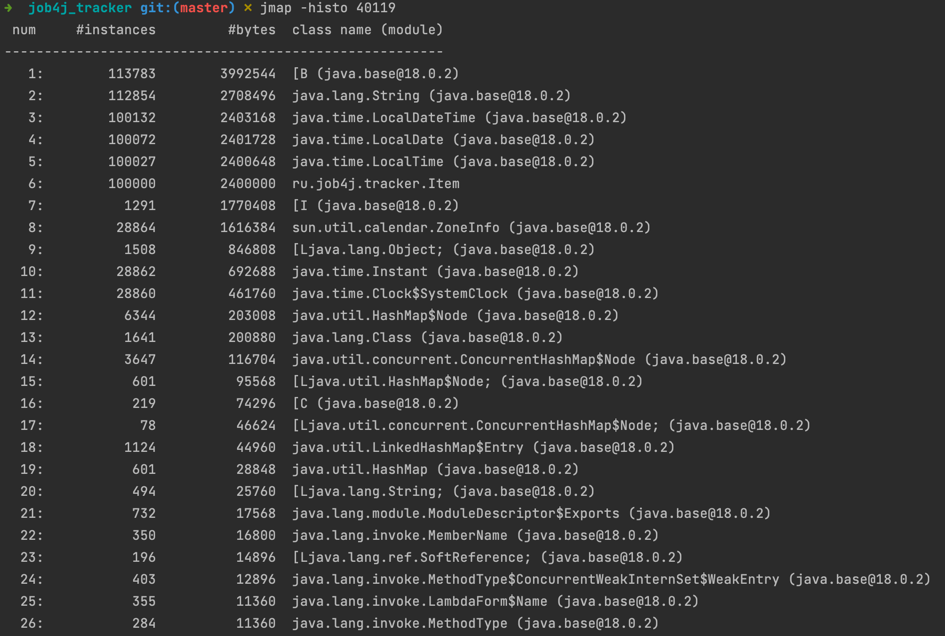

### Улититы jps, jmap, jstat
    JPS + JMAP
Тест проводился со 100К объектов.   

До создания:    
 

После создания: 

После создания обектов в списке приобладают поля класса Item: Имя и дата.    
3 класса раздела пакета Time - поэтапное преобразование в нужный формат.   

    JPS + JSTAT
Тест проводился с созданием 100М объетов, для того, чтобы было видно плавное изменение показателей в статистике.
[jstat_log_create_100M_items](Log_jstat)

В статистике видно поэтапное увеличение потребляемой памяти "Выживших" объектов.    
Нуливые показатели указывают на то, что приложение останавливалось для чистки памяти,   
т.к. использовался -XX:+UseSerialGC.     
В тот же момент уменьшилось потребление памяти Эдема, где создаются объекты.

    JCONSOLE
Тест проводился со 100К объектов.

Потребления памяти: видны "ступеньки" - это работа GC.
Кол-во потоков изменилось, скорее всего, из-за JIT оптимизации.  
CPU нагрузка: видны 3 пика в начале работы программы: 
1. Запуск приложения, 
2. Запуск создания 100К объектов, 
3. Удаление объектов.

Установлены флаги: -Xmx40m -Xms20m -XX:+UseParallelGC
GC приходит и чистит память при достяжении ± 20М потребляемой памяти.

При разных начально установленных флагах потребление памяти будет разное.    
Флаги для GC влияют на скорость работы программы и "плавность" отчистки.
Флаги для ограничения потребляемой памяти повлият на частоту вызова GC и стойкость самого приложения,   
если установить в пограничные значения, то приложение может упасть из-за резкий скачков нагрузки данных   
или из-за не учета потреблямой памяти самого GC (он составляет от 2 до 10% всего выделенного хипа).